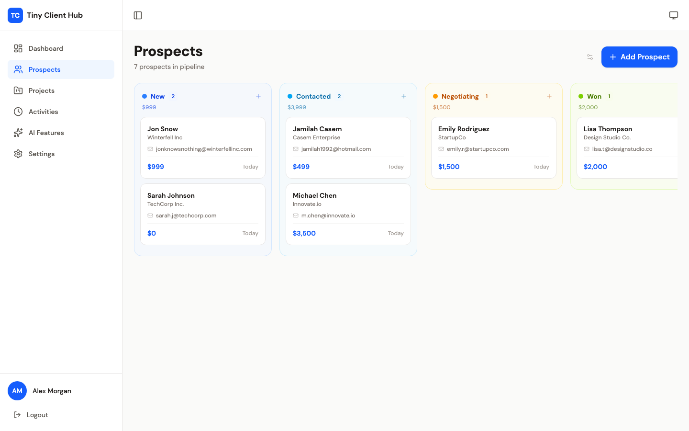

# Kanban Starter

A production-ready Trello-style kanban board for React + TypeScript + Tailwind CSS.

Built with [`@hello-pangea/dnd`](https://github.com/hello-pangea/dnd) (Atlassian's `react-beautiful-dnd` fork — the same engine that powers Trello).



---

## Why This Exists

You might be wondering: _"Why not just use a kanban library or copy Trello's setup?"_

Here's the thing — we tried that. We spent **hours** debugging drag-and-drop issues that every tutorial skips over:

- **The cursor offset bug** — cards appearing far from where you grabbed them because of CSS transforms
- **The flash/reload bug** — page re-rendering every time you drag a card because of re-fetching data
- **The rigid sorting bug** — cards snapping back because the library and local state were out of sync

This starter is the result of solving all those problems for real, in production. It's not a tutorial project — it's battle-tested code extracted from a working CRM.

### How is this different from just using `@hello-pangea/dnd` directly?

`@hello-pangea/dnd` gives you the drag-and-drop engine. This starter gives you the **full kanban board**:

| What you'd build yourself       | What this gives you                           |
| ------------------------------- | --------------------------------------------- |
| Drag-and-drop engine only       | Full pipeline with columns, cards, reordering |
| No data layer                   | API hook with optimistic updates              |
| No CRUD UI                      | Create/edit/delete modal with form validation |
| Fixed card layout               | Trello-style field visibility toggle          |
| Light mode only                 | Full dark mode support                        |
| Plain text fields               | Links/URLs system (LinkedIn, website, etc.)   |
| Activity log you build yourself | Activity timeline component                   |
| Cards that offset from cursor   | Cards that stick to your grab point           |

### Why not a library you install?

Libraries have to be generic. They give you `<KanbanBoard>` with a million props to configure. This starter gives you **actual code you own** — copy it, rename the entity, tweak the fields, and it's yours. No abstractions to fight, no version conflicts, no breaking updates.

When we need a kanban for a new project now, it takes **5 minutes** instead of 2 days.

---

## Features

- ✅ **Drag-and-drop** — cursor sticks to grab point, reorder within columns, cross-column drops
- ✅ **Optimistic updates** — instant UI, no loading flash, API fires in background
- ✅ **Field visibility toggle** — Trello-style card display options, persisted to localStorage
- ✅ **Links/URLs** — LinkedIn, website, portfolio, etc. stored as JSON
- ✅ **Dark mode** — full dark mode support via Tailwind
- ✅ **CRUD modal** — create, edit, delete with form validation
- ✅ **Activity timeline** — chronological interaction log

---

## Quick Start

### 1. Install dependency

```bash
npm install @hello-pangea/dnd
```

### 2. Copy the template

Copy `src/kanban/` into your project:

```
your-project/src/
└── pages/items/          # rename "items" to your entity
    ├── ItemsPipeline.tsx
    ├── useItemsData.ts
    ├── types.ts
    ├── index.ts
    └── components/
        ├── PipelineColumn.tsx
        ├── ItemCard.tsx
        ├── ItemDetailModal.tsx
        ├── ActivityTimeline.tsx
        ├── CardFields.tsx
        └── index.ts
```

### 3. Customize

Find and replace these placeholders with your entity:

| Placeholder                          | Example                                  |
| ------------------------------------ | ---------------------------------------- |
| `Item` (component names)             | `Prospect`, `Task`, `Candidate`          |
| `item` (variable names)              | `prospect`, `task`, `candidate`          |
| `Items` (display names)              | `Prospects`, `Tasks`, `Candidates`       |
| Column statuses in `types.ts`        | `New, Contacted, Negotiating, Won, Lost` |
| Column colors in `ItemsPipeline.tsx` | `blue, sky, amber, lime, stone`          |
| API paths in `useItemsData.ts`       | Your API endpoints                       |
| Card fields in `CardFields.tsx`      | Fields relevant to your entity           |

### 4. Wire into your app

```tsx
// App.tsx
import { ItemsPipeline } from "./pages/items/ItemsPipeline";

<Route path="/items" element={<ItemsPipeline />} />;
```

### 5. Update your API

Make sure your backend has these endpoints:

| Method | Path             | Description    |
| ------ | ---------------- | -------------- |
| GET    | `/api/items`     | List all items |
| POST   | `/api/items`     | Create item    |
| PUT    | `/api/items/:id` | Update item    |
| DELETE | `/api/items/:id` | Delete item    |

---

## Critical Rules

These are non-negotiable — violating them breaks drag-and-drop. We learned these the hard way:

1. **No CSS transforms** on cards or any parent element

   - ❌ `hover:translate-y`, `scale-*`, `rotate-*`, `animate-*` with transform
   - ✅ `box-shadow` for hover effects, `border-color` transitions
   - **Why:** The library calculates cursor offset from DOM position. Transforms shift the visual without updating layout, causing offset.

2. **No CSS gap, space-y, or child margins** for card/column spacing

   - ❌ `gap-4`, `space-y-2.5`
   - ❌ `margin-bottom` on a child wrapper inside Draggable
   - ✅ `margin-right` on column wrappers, `padding-bottom` on the Draggable container itself
   - **Why:** `getBoundingClientRect()` includes element padding but NOT child margins. Placeholder mismatch causes drop snap.
   - **Why:** Flex gap uses internal margin calculations that confuse the library's positioning.

3. **No overflow scroll** on droppable containers

   - ❌ `overflow-y-auto` on the Droppable div
   - ✅ `overflow: visible`
   - **Why:** Scroll offset gets added to the cursor position calculation.

4. **Never re-fetch** after mutations
   - ❌ `await api.update(); await api.list();`
   - ✅ Update local state instantly, fire API in background
   - **Why:** Re-fetching causes a full re-render that resets card positions and creates a visible flash.

---

## Architecture

```
ItemsPipeline.tsx      ← DragDropContext, columnOrder state, handlers
  └─ PipelineColumn    ← Droppable + Draggable wrappers
       └─ ItemCard     ← Pure presentational, no drag logic
```

The card component is **purely presentational** — all drag logic lives in the column wrapper. This separation is important for the drag-drop library to work correctly.

---

## Links/URLs Schema

Links are stored as a JSON TEXT column in your database:

```sql
ALTER TABLE items ADD COLUMN links TEXT;
```

Format: `[{"label":"LinkedIn","url":"https://linkedin.com/in/..."}]`

Available labels: LinkedIn, Website, Twitter, GitHub, Portfolio, Other

---

## API Hook Pattern

The `useItemsData` hook follows the optimistic update pattern:

```typescript
// Update: change local state instantly, fire API in background
const updateItem = async (id, updates) => {
  // 1. Optimistic update
  setState((prev) => ({
    items: prev.items.map((i) => (i.id === id ? { ...i, ...updates } : i)),
  }));

  // 2. Fire API
  try {
    await api.update(id, updates);
    // No re-fetch! Local state is already correct.
  } catch {
    // Rollback on error
    setState((prev) => ({
      items: prev.items.map((i) => (i.id === id ? original : i)),
    }));
  }
};
```

---

## Who is this for?

- **Indie developers** building CRMs, project managers, hiring trackers, or any app with pipeline stages
- **Small teams** who want a working kanban without spending days on drag-and-drop
- **Anyone who's fought `@dnd-kit`** and wants something that just works

---

## License

MIT — use it however you want.
